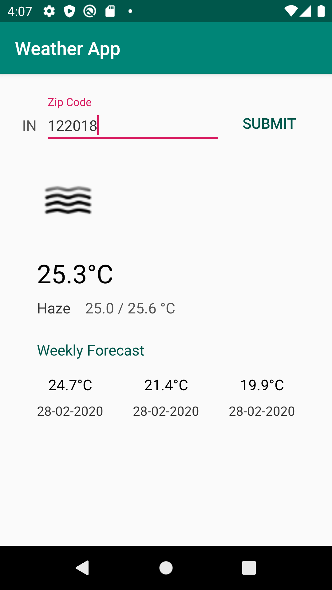

# weather-app
Shows the weather based on zip-code

## Overview
Open-Weather API to fetch and display current weather-report, using android-best-practices.

## Implementation
- Architecture - MVVM (ViewModels + DataBinding)
- Dependency Injection - Dagger 2
- Async Processing - Coroutines
- Network - Retrofit + Coroutines
- Database - Room + Coroutines

## Screenshot

